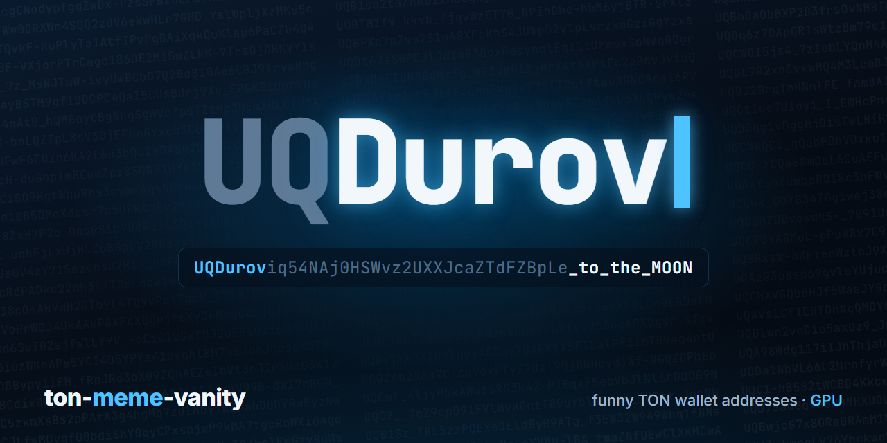

# TON Vanity — «смешные» адреса TON-кошелька на видеокарте

<p align="center"></p>

[](https://github.com/pkmt-commits/ton-meme-vanity/actions/workflows/ci.yml)
[](LICENSE)

-0098EA)

**[Full English README →](README.en.md)**

**EN, in short:** a CUDA vanity-address generator for TON wallets (W5 / v5r1, `UQ…`). Instead of hunting for one fixed
suffix, it scores every address for *funny readable phrases* (`…wen_LAMBO`, `…rug-PULL`, `UQBOOM…REKT`) and sends
the best ones to Telegram. Every key is re-verified with the official `@ton/ton` library.
Requirements: NVIDIA GPU, Node.js 20+, CUDA Toolkit, and on Windows the Visual Studio 2022 Build Tools (C++).

```
npm run setup     # checks the toolchain, detects your GPU, builds the kernel, self-tests it against @ton/ton
npm run hunt      # start hunting (Ctrl+C to stop); found keys go to gems.jsonl — never share that file
npm run top       # best addresses found so far, without keys
```

**Why not just a mask?** Fixed-mask generators are practically limited to 6–8 characters: every extra letter costs ~32x more
attempts. This one accepts thousands of words and word pairs at once, so it keeps finding 2–3-word phrases of 9–12 characters
(`…Y3ah2goaT` = "yeah 2 goat") that would take ~10^14 attempts to hit on purpose — the examples in this README came from
a single 44-second test run. The trade-off: you can't order a specific phrase — you pick from what turns up.

**Raw keys, not 24 words.** A TON key from a 24-word phrase costs 100,000 PBKDF2-HMAC-SHA512 iterations (and only ~1 in 256
random phrases is valid), so phrase-based generators are roughly 1000x slower. Here raw ed25519 seeds are searched directly:
tens of millions of addresses per second on modern NVIDIA GPUs. Found keys import into MyTonWallet (tested); wallets that accept only
24 words (e.g. Tonkeeper) can't import them.

**Four addresses per key.** With `--versions 4` every key is checked as W5, V4R2, V3R2 and V3R1 wallets — that's two extra SHA-256
per address instead of another curve multiplication, so ~2.2x more addresses per second. MyTonWallet lists all four versions of an
imported key (Settings → Wallet Versions).

**Check any address in your browser:** [address checker](https://pkmt-commits.github.io/ton-meme-vanity/) — paste a TON address, see the hidden words and patterns, how interesting, good-looking and meme-worthy it is, and how rare (nothing leaves the page).

Using an AI coding agent? Point it at [AGENTS.md](AGENTS.md). Docs and code comments are in Russian.

---

Обычный vanity-генератор ищет заданное окончание (`…_DUROV`). Этот ищет адреса, в которые знающий человек
**не поверит, что они случайные**: слова и фразы на конце (`…NGMI-ser`, `…good_JOB`), мемное слово сразу после
`UQ`, растяжки (`Swwwwwwag`), смайлы на контрасте регистра (`-_-`, `o_O`), мем-числа (`420`, `69`, `67`),
«адрес из документации» (`UQABCDEF…`, `UQAAAAAA…`).

**Без видеокарты и установки:** [Свой красивый TON-адрес](https://pkmt-commits.github.io/ton-meme-vanity/generate.html) — тот же поиск прямо в браузере
(ключи создаются на вашем устройстве; на обычном компьютере сотни тысяч адресов в секунду, за несколько минут — адрес
на ~200 очков; работает и на телефоне, найденные ключи импортируются в MyTonWallet — проверено). Собирается `npm run build:generator` в `docs/generate.html`.

**Проверить любой адрес:** [Красота TON-адреса](https://pkmt-commits.github.io/ton-meme-vanity/) — вставьте TON-адрес, страница покажет спрятанные слова и узоры, насколько адрес интересный, красивый и мемный и как редко такое выпадает (всё считается в браузере). Собирается `npm run build:checker` в `docs/index.html`.

## Чем отличается

### 1. Фразы, а не маска

Генератор по маске ищет одно заданное окончание. Каждая лишняя буква — примерно в 32 раза больше попыток,
поэтому на практике маска ограничена 6–8 символами (`…_durov`, `…moon`).

Здесь засчитываются **тысячи слов и их сочетаний одновременно**. Поэтому постоянно находятся фразы из 2–3 слов длиной
9–12 символов, которые по маске искать бесполезно:

| Окончание | Читается как | Найти именно его по маске | Время поиска по маске¹ |
|---|---|---|---|
| `…Y3ah2goaT` | yeah 2 goat | ~140 трлн попыток | от месяца до полугода с лишним |
| `…x4xa_0kUSh` | xaxa kush | ~9 000 трлн попыток | от 5 до 35 лет |

**Оба адреса (и все примеры ниже) найдены за один тестовый прогон длиной 44 секунды** на одной домашней видеокарте —
вместе с ещё полусотней находок.

¹ При 8–60 млн адресов/с — грубая оценка для современных видеокарт NVIDIA, от среднего класса до топовых
(точную скорость вашей покажет `npm run bench`).

Цена подхода: **конкретную фразу заказать нельзя**, вы выбираете из того, что выпало (бот присылает лучшее).
Если нужно именно своё короткое окончание, есть режим `--suffix` (см. ниже).

### 2. Перебираются ключи, а не фразы из 24 слов

Ключ от фразы из 24 слов TON получает через PBKDF2-HMAC-SHA512 со **100 000 итераций**, а из случайных фраз подходит только
~1 из 256 (ещё по 390 итераций на проверку). Итого ~400 000 вычислений SHA-512 на **каждый** ключ — генераторы, которые
перебирают фразы, примерно в тысячу раз медленнее.

Здесь перебираются сами приватные ключи (32-байтные сиды ed25519): один SHA-256, один SHA-512 и одно умножение
на эллиптической кривой на ключ (16 сложений точек с таблицей 60 МБ в видеопамяти). Поэтому и скорость — десятки
миллионов адресов в секунду.

### 3. До четырёх адресов с одного ключа

Адрес кошелька зависит не только от ключа, но и от версии контракта. С флагом `--versions 4` каждый ключ проверяется
как кошелёк **W5, V4R2, V3R2 и V3R1**: лишний адрес стоит два SHA-256 вместо ещё одного умножения на кривой, поэтому
адресов в секунду становится примерно в 2.2 раза больше. MyTonWallet показывает все четыре версии импортированного
ключа (Настройки → Wallet Versions) и переключается на любую — импорт всех четырёх проверен вживую (октябрь 2026). По умолчанию ищется только W5 — самая новая версия
(в ней, например, есть оплата комиссии в USDT); V4R2 тоже распространена, V3 — старые, но рабочие.

Обратная сторона: **24 слов у найденного кошелька нет**, есть приватный ключ. Его импорт проверен и работает
в **MyTonWallet** (октябрь 2026, см. «Как завести найденный кошелёк»). Кошельки, которые принимают только 24 слова
(например, Tonkeeper), такой ключ не импортируют.

## Как это работает

Видеокарта перебирает ключи и для каждого адреса сама считает оценку v5 — ту же разметку на слова, тот же словарь
(~47 тыс. слов) и те же веса, что у точной оценки в Node («сито v5-lite»). Наружу уходят только адреса с оценкой от
`--save-min − 10` — несколько на миллион. Node-обёртка пересчитывает их точно, сохраняет хорошие (с ключом, только
у вас на диске) и раз в несколько минут присылает в Telegram лучший за это время — с кнопками 👍 / 😐 / 👎 / ⭐.

Раньше на видеокарте были отдельные «правила слов», похожие на оценку лишь грубо. Замер на 200 млн случайных адресов
показал, что они пропускали только ~25% адресов, которые оценка считает хорошими (150+): не видели трёхбуквенных слов
на границе регистра (`scamKEK`, `L0hRug`), «рваного» регистра (`RugWEeD`) и знали 7 тыс. слов. Сито v5-lite совпадает
с оценкой в пределах ±2 очков у 96–99% адресов и пропускает 99% хороших — при той же скорости, то есть хороших находок
примерно в 4 раза больше. Проверить самому: `node src/recall_sample.mjs 20 sample.jsonl` (случайные адреса без ключей,
на процессоре) и `node src/recall_eval.mjs` по выводу `node scripts/kernel.mjs flags`.

```
cuda/vanity  (видеокарта: ed25519 seed → pubkey → адреса W5 [+V4R2, V3R2, V3R1], оценка v5-lite, узоры)
   └─ печатает "HIT <seedHex> <адрес>"
src/run_cuda.mjs (обёртка + дашборд)
   ├─ scoreV5(адрес) — точная оценка
   ├─ оценка ≥ --save-min → проверка ключа официальной @ton/ton → gems.jsonl (С КЛЮЧОМ)
   └─ лучший за окно → Telegram (ТОЛЬКО адрес) → кнопка ⭐ → favorites.jsonl
```

## Быстрый старт

Нужно: видеокарта NVIDIA, Windows 10/11 (Linux должен работать, но не проверялся).

1. Поставьте [Node.js](https://nodejs.org) LTS, [драйвер NVIDIA](https://www.nvidia.com/drivers),
   [CUDA Toolkit](https://developer.nvidia.com/cuda-downloads) и (только Windows)
   [Build Tools for Visual Studio 2022](https://visualstudio.microsoft.com/visual-cpp-build-tools/) с компонентом
   «Разработка классических приложений на C++».
2. В папке проекта:
   ```
   npm run setup
   ```
   Скрипт сам проверит всё нужное, определит модель видеокарты, соберёт ядро и прогонит самопроверку.
   Если чего-то не хватает — напишет, что поставить. Можно запускать повторно.
3. Охота:
   ```
   npm run hunt        (Ctrl+C — стоп)
   npm run top         (лучшие найденные адреса, без ключей)
   ```

Пример `npm run top` (адреса из тестового прогона; ключи от них уничтожены — не отправляйте на них деньги):

```
  227  T1:aaaaass                  UQBHZEO8PZ60426yiseuBbJBfSoICVT7TWBuMzW-Baaaaass
  215  T2:Y3ah_goaT                UQC5PS0DCjuLHTFvAy-2WB3TfV5utOrqSHWmBNxY3ah2goaT
  198  T2:x4xa_kUSh                UQDzdCq-qAR68Lq6KvweGQNDBsYUSVHSo96d25x4xa_0kUSh
  191  TS:BLyA_…_poor              UQBLyA25xBc6o4Xwq7ZqJvtQ3HDPsgd4xiOXS7xtf219poor
  191  TS:AaPed_…_farm             UQAaPed5QqrkzPoCcm2zpdnWiTx9tfsMfILIk9Gd5-KNfarm
  190  TM:butt4                    UQBUTTTTqcNR3XnNdRr_kWZyjMbZYYTCdkRNevbpAQQ7G7qP
```

Метки: `T1` — одно слово с «редкостью» (растяжка, повторы), `T2` — пара слов на конце, `T3` — три и больше,
`TS` — слово сразу после `UQ` + конец, `TM` — растянутое слово где угодно.

Работает с AI-агентом (Claude Code, Codex, Cursor и др.): дайте ему ссылку на репозиторий и попросите
«установи и запусти по AGENTS.md».

## Что проверяется

| Проверка | Как запустить |
|---|---|
| Ядро считает pubkey и адрес так же, как официальная `@ton/ton` (20 тестовых сидов × 4 версии кошелька, с таблицей и без) | `npm run selftest` (входит в setup) |
| Сито v5-lite на видеокарте == оценка `src/score_v5.mjs` (3000 адресов со словами и фразами) | `node ref/check_v5lite.mjs` (входит в setup) |
| Быстрый детектор узоров/растяжек на видеокарте == эталонный, на миллионах адресов | `node scripts/kernel.mjs validate 15` (короткая версия входит в setup) |
| Быстрый путь адреса в Node == `@ton/ton`, 3000 случайных сидов | `npm run smoke` |
| Каждый сохранённый ключ | перепроверяется `@ton/ton` перед записью, расхождения видны на дашборде (должно быть 0) |
| Скорость вашей карты | `npm run bench` |

Проверено автором на Windows 11 с RTX 3080 Ti.

## Сколько это стоит по времени

Каждая буква точного окончания (регистр не важен) встречается примерно в 32 раза реже, разделитель `-`/`_` или
цифра — в 64 раза. Нужное число попыток для одного конкретного окончания:

| Окончание | Пример | Попыток в среднем |
|---|---|---|
| 4 буквы | `…moon` | 1 млн |
| 5 букв | `…durov` | 34 млн |
| 6 букв | `…degens` | 1 млрд |
| `_` + 6 букв | `…_valera` | 69 млрд |
| 8 букв | `…lambolol` | 1.1 трлн |
| 9 букв | `…moontoday` | 35 трлн |

Время = попытки ÷ скорость вашей карты (`npm run bench`, адресов в секунду). Грубо: современные видеокарты NVIDIA дают
от ~8 млн (средний класс) до ~60 млн (топовые) адресов в секунду с одной версией кошелька и примерно вдвое больше
с `--versions 4`.

Режим «смешных адресов» ловит одновременно тысячи слов и пар слов, поэтому хорошие находки идут постоянно.
А вот лучший адрес растёт медленно: в 30 раз больше перебора — это примерно одна лишняя «удачная буква».

## Безопасность — прочитайте

- **Ключи создаются и остаются только у вас.** В сеть уходит только адрес (в Telegram). Сид — 32 байта
  ed25519, тот же формат, что в официальных библиотеках TON.
- **`gems.jsonl` и `favorites.jsonl` содержат приватные ключи** (`seedHex`, `secretKeyHex`). Это доступ
  к кошелькам. Не показывайте, не коммитьте (они в `.gitignore`), не вставляйте в чаты и в ИИ-ассистенты.
  Смотреть находки безопасно так: `npm run top` — он печатает только адреса.
- **Как получается ключ.** Сид = `SHA-256(база ‖ номер)`: база — 32 случайных байта из системного
  криптогенератора (`std::random_device`: на Windows — `RtlGenRandom`, на Linux — системный источник libstdc++),
  номер — 64-битный счётчик. Утечка одного ключа ничего не говорит о других. Случайность берётся прямо у ОС
  (`BCryptGenRandom` / `getrandom`), с проверкой, что база не нулевая и не повторяется.
- **Видеопамять.** CUDA не очищает память между процессами (`cudaMalloc`: «The memory is not cleared»), и остатки
  данных прошлых программ давно умеют читать. Ядро само стирает сиды находок сразу после передачи и базу при выходе.
  Если охоту убили принудительно, база последней серии может остаться в видеопамяти до перезагрузки — на чужом или
  общем компьютере после охоты лучше перезагрузиться.
- **История (до публикации, исправлено):** в ранних версиях (1) генератор заводился от 32-битного числа
  (`mt19937`) — ключи можно было перебрать, тот же класс ошибки, что у Profanity (взлом Wintermute, 2022);
  (2) сид был просто `номер ‖ база` — по одному утёкшему ключу находились соседние.
- Перед тем как класть средства, импортируйте кошелёк и **сверьте адрес символ в символ**.
- Это новый кошелёк, которым владеете только вы. Подобрать так чужой кошелёк невозможно: совпадает лишь
  косметическая часть адреса.

## Параметры охоты

`npm run hunt -- --max-temp 75 --per-hour 6` и т.п.:

| Флаг | По умолчанию | Что |
|---|---|---|
| `--max-temp` | 80 | целевая температура видеокарты, °C |
| `--save-min` | 150 | порог оценки для записи в `gems.jsonl`. С ситом v5-lite при 150 пишется ~10 находок/с на быструю карту — поднимите до 180–200, если файл растёт слишком быстро (+10 очков ≈ вдвое меньше) |
| `--v5t` | save-min − 10 | порог сита на видеокарте (0 — старые правила слов) |
| `--per-hour` | 11 | сообщений в Telegram в час (лучший за окно) |
| `--min-bot` | 100 | минимальная оценка для Telegram |
| `--cap` | 25 | сколько хранить адресов с одной меткой |
| `--start-every` | 4 | каждое N-е сообщение — лучший со словом сразу после `UQ` (0 — выкл) |
| `--versions` | 1 | версий кошелька на ключ: 1 — только W5, 4 — W5, V4R2, V3R2, V3R1 (адресов в ~2.2 раза больше) |

**Термозащита.** Ядро само держит температуру: регулирует долю нагрузки, при цель+5°C полностью встаёт до
цель−6°C, при цель+10°C (но не выше 90°C) или отказе датчика останавливается. Без NVML (часть драйвера) не
запускается. Если карта греется сильно — поднимите обороты вентиляторов и/или снизьте Power Limit
(например, MSI Afterburner): скорость почти не падает.

**Точное окончание** вместо «смешных» адресов:
```
node scripts/kernel.mjs --suffix _durov > hits.txt    (в файле КЛЮЧИ; Ctrl+C — стоп)
node src/check_hits.mjs hits.txt                       (сверка с @ton/ton, ключи не печатает)
```

Служебные режимы ядра (`node scripts/kernel.mjs <режим>`): `selftest <файл сидов>`, `validate N`,
`stats N` (частоты правил сита), `bench N`.

## Telegram (по желанию)

1. Создайте бота у [@BotFather](https://t.me/BotFather) и напишите ему любое сообщение.
2. Скопируйте `telegram.config.example.json` → `telegram.config.json`, впишите `token`.
3. `npm run telegram-setup` — найдёт ваш `chatId`, впишет его в конфиг и пришлёт тестовое сообщение.

Или задайте переменные `TG_BOT_TOKEN`, `TG_CHAT_ID`. Если Telegram открывается только через прокси —
переменная `HTTPS_PROXY` или системный прокси Windows (подхватывается сам).

Кнопки: 👍 / 😐 / 👎 пишутся в `data/taste/reactions.jsonl` (материал для своей подстройки оценки),
⭐ копирует запись с ключом в `favorites.jsonl`.

## Как завести найденный кошелёк

Ключ — сырой сид, 24 слов для него нет. Проверено с **MyTonWallet** (октябрь 2026 — импорт работает без проблем):

1. Добавить кошелёк → **Import from Secret Words**.
2. В поле **первого слова** вставьте `seedHex` (64 hex-символа) нужной записи. Без пробелов и переноса
   строки, иначе будет «непредвиденная ошибка».
3. Кошелёк должен показать **ровно тот же адрес** `uq`. Сверьте и только потом переводите средства.
Буфер обмена: скопированный сид остаётся в журнале буфера Windows (Win+V), а при включённой «Синхронизации между
устройствами» — уходит в облако Microsoft; клавиатуры телефонов тоже запоминают вставленное. После импорта очистите журнал
(Win+V → «Очистить всё») или вводите ключ без буфера.
4. Если у записи `ver` не `W5` (охота с `--versions 4`): после импорта откройте **Настройки → Wallet Versions** и выберите
   эту версию (`V4R2`, `V3R2` или `V3R1`) — кошелёк переключится на нужный адрес. Его тоже сверьте символ в символ.

Как адрес выглядит в разных местах:

- Смешной конец виден в форме `UQ…` (так кошельки показывают адреса кошельков). В «отскакивающей» форме `EQ…` первые
  два символа другие, а **последние три — контрольная сумма, и они тоже другие**: `…Y3ah2goaT` → `…Y3ah2gttW`.
- В base64 без «url-safe» разделители `-` и `_` выглядят как `+` и `/` (`x4xa_0kUSh` → `x4xa/0kUSh`). Почти все
  кошельки и обозреватели показывают url-safe вид.
- **Отравление адреса (address poisoning).** Мошенники подбирают адрес с теми же началом и концом, что у вашего, и
  присылают копеечный перевод, чтобы вы скопировали их адрес из истории. Запоминающийся конец не защищает от этого,
  а скорее приучает смотреть только на него. Переводя на свой адрес, сверяйте его целиком или берите из кошелька.

## Настройка вкуса

Оценка подогнана под вкус автора: мат (en + рус. транслит), крипто-сленг, рофлы, ирония. Свой вкус:

- `src/words_curated.mjs` — отборные слова и любимые темы (получают бонус). Правьте свободно.
- `src/gems.mjs` → `SLANG` — сленг; `node -e "import('./src/gems.mjs').then(m=>m.writeWordsHeader())"`
  пересобирает словарь видеокарты `cuda/words.h`, затем `npm run setup -- --force`.
- `data/word_votes.json` — оценки слов автором (`1` / `0` / `-1`). Удалите файл — оценка станет нейтральнее.
- `src/score_v5.mjs` → `P5` — веса. Как устроено: адрес разбивается на слова по частотному словарю,
  выигрыш слова = 5 бит × длина − цена слова по частоте; плюс бонусы за темы, обособленность (разделители,
  контраст регистра), фразу на конце, слово после `UQ`, растяжки, смайлы, мем-числа.

## Файлы

| Путь | Что |
|---|---|
| `scripts/setup.mjs` | проверка окружения, сборка, самопроверка |
| `cuda/vanity.cu` | ядро: ed25519 (fixed-base, окно 16 бит, пакетное обращение Монтгомери), SHA-256/512, адреса W5/V4R2/V3R2/V3R1, термо-регулятор |
| `cuda/v5lite.inc`, `cuda/v5dict.h` | сито v5-lite: оценка v5 на видеокарте; словарь генерирует `src/gpu_dict_v5.mjs` из `src/score_v5.mjs` (делает setup) |
| `cuda/detector_words.inc` | правила узоров и растяжек (быстрая и эталонная версии), старые правила слов |
| `src/recall_sample.mjs`, `src/recall_eval.mjs` | замер полноты сита на случайных адресах |
| `cuda/words.h`, `base_table.h`, `sha_const.h`, `calib.h`, `calib_multi.h` | сгенерированные таблицы (`src/gems.mjs`, `cuda/gen_*.mjs`, `ref/calib.mjs`) |
| `cuda/tbl16.bin` | таблица окна 16 бит, 60 МБ (`cuda/gen_wtable.mjs`, делает `npm run setup`; в git не хранится) |
| `src/run_cuda.mjs` | обёртка: оценка, сохранение, Telegram, дашборд |
| `src/score_v5.mjs` | оценка «смешности» |
| `src/verify.mjs`, `src/check_hits.mjs` | независимая проверка ключей официальной `@ton/ton` |
| `scripts/top.mjs` | просмотр находок без ключей |
| `tests/` | автотесты оценки и адреса (`npm test`, видеокарта не нужна) |
| `data/en_zipf.tsv` | частоты английских слов |

## Лицензии и благодарности

- Код — [MIT](LICENSE).
- `data/en_zipf.tsv` — выборка из [wordfreq](https://github.com/rspeer/wordfreq) (Robyn Speer), данные под
  [CC BY-SA 4.0](https://creativecommons.org/licenses/by-sa/4.0/); файл распространяется на тех же условиях.
- [`@ton/ton`, `@ton/core`, `@ton/crypto`](https://github.com/ton-org), [tweetnacl](https://github.com/dchest/tweetnacl-js),
  [noble-curves](https://github.com/paulmillr/noble-curves).
- Идея оценки «неслучайности» — из wordninja и детекторов DGA-доменов.

Используйте на свой риск. Это не финансовый совет и не аудированный криптографический продукт.
